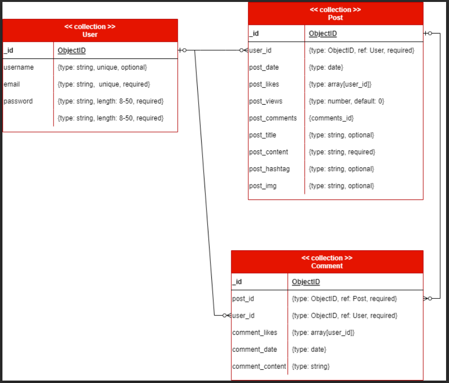

# Blog App Backend

## About

A blog api for a blog application where users can post, comment, and like each other's post.

## Frontend Repository

[frontend repository link](https://github.com/mindy-d-tran/blog-app-frontend)

## Live Demo

Deployed on netlify: [blog app live demo](https://main--ps-blog-app.netlify.app/)

# Approach

Users can use full CRUD for users, posts, and comments

## Technology Used

### Backend

- Nodejs
- Express
- Mongoose
- MongoDB
- Bcrypt (Password encrypting, hashing)

## Planning

## Trello Board

[trello board link](https://trello.com/invite/b/xMjVRQSG/ATTI0edbb0da239b30e52dd61d33368ae80f69D00CD7/ps-capstone-project)

## Entity Relationship Diagram (ERD)

[ERD](https://drive.google.com/file/d/14j2IKmw6vyK-PiW4wrSRmKZa3s_J_noH/view)


# Routes

## Users Route

### GET /api/users

Reads all users in the database

### PUT /api/users/login

Returns the user data if the login attempt is a sucess

#### Body (JSON)

```
{
    emailOrUsername: String,
    password: String
}
```

### GET /api/users/:id

Read a single user's data

- id = user \_id

### POST /api/users

Create a new user and returns new user data

#### Body (JSON)

```
{
    email: String (required, unique),
    username: String (required, unique),
    password: String (required)
}
```

### PUT /api/users/:id/update-profile-pic

Updates the user's profile picture

- id = user \_id

#### Body (JSON)

```
{
    profile_pic: String
}
```

### PUT /api/users/:id/update-username

Updates the user's username

- id = user \_id

#### Body (JSON)

```
{
    username: String
}
```

### PUT /api/users/:id/update-email

Updates the user's email

- id = user \_id

#### Body (JSON)

```
{
    email: String
}
```

### PUT /api/users/:id/update-password

Updates the user's password. Shout out to Abraham Tavarez for the [code](https://github.com/AbeTavarez/cohort107/blob/main/nodejs/mongoose-api/backend/routes/users.js)

- id = user \_id

#### Body (JSON)

```
{
    currentPassword: String,
    newPassword: String
}
```

### DELETE /api/users/:id/

Delete a user from the database

- id = user \_id

## Posts Route

### GET /api/posts

Reads all posts in the database

### GET /api/posts/:id

Read a single post's data

- id = post \_id

### POST /api/posts

Create a new post and returns new post data

#### Body (JSON)

```
{
    user_id: String (required, unique),
    post_title: String (default ""),
    post_content: {
        text: String,
        img: [String]
    } (required),
    post_hashtag: [String]
}
```

### PUT /api/posts/:id

Create a new post and returns new post data

- id = post \_id

#### Body (JSON)

```
{
    user_id: String (required, unique),
    post_title: String (default ""),
    post_content: {
        text: String,
        img: [String]
    } (required),
    post_hashtag: [String]
}
```

### PUT /api/posts/:id/update_content

Updates the post's content

- id = post \_id

#### Body (JSON)

```
{
    post_title: String (default ""),
    post_content: {
        text: String,
        img: [String]
    },
    post_hashtag: [String]
}
```

### PUT /api/posts/:id/update_content_text

Updates the post's content's text

- id = post \_id

#### Body (JSON)

```
{
    text: String,
}
```

### PUT /api/posts/:id/update_content_img

Updates the post's content's image

- id = post \_id

#### Body (JSON)

```
{
    img: [String]
}
```

### PUT /api/posts/:id/update_title

Updates the post's title

- id = post \_id

#### Body (JSON)

```
{
    post_title: String
}
```

### PUT /api/posts/:id/update_hashtag

Updates the post's hashtags

- id = post \_id

#### Body (JSON)

```
{
    post_hashtag: [String]
}
```

### PUT /api/posts/:id/like

Updates the post's like (user like the post)

- id = post \_id

### PUT /api/posts/:id/unlike

Updates the post's like (user unlike the post)

- id = post \_id

### DELETE /api/posts/:id

Delete a post

- id = post \_id

## Comments Route

### GET /api/comments

Reads all comments in the database

### GET /api/comments/:id

Read a single comment's data

- id = comment \_id

### GET /api/comments/post/:post_id

Read all comment's for one post

- post_id = post \_id

### POST /api/comments

Create new comment

#### Body (JSON)

```{
    user_id: String (required),
    post_id: String (required),
    comment_content: String (required)
}
```

### PUT /api/comments/:id/like

Updates the comment's like (user like the comment)

- id = comment \_id

### PUT /api/comments/:id/unlike

Updates the comment's like (user unlike the comment)

- id = comment \_id

### DELETE /api/comments/:id/

Delete a comment from the database

- id = comment \_id

# Future Implementations

- Create search route so user's can search for posts through query
- Create search router for advance search to give users filters when searching for things on the application
- Create a profile schema so users can learn more about each other in the app
